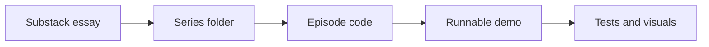

# Harika Yenuga Substack Series

> Companion code for essays, experiments, and production-minded data science notes from my Substack.

[](#)
[](#)
[](https://substack.com/@harikayenuga)
[](./LICENSE)

This repo is the code home for my personal Substack series:
small, readable implementations of statistical and AI techniques that show up
inside real systems.

Each series gets its own folder. Each episode includes working code, a runnable
demo, visualizations, tests, and notes on where the technique helps or fails.



## Series

| Series | Focus | Episodes |
|--------|-------|----------|
| [The Unnamed Pipeline](./the-unnamed-pipeline/) | Production data science techniques that textbooks skip | 2 |

## Episodes

| Series | # | Episode | Real Question | Industry | Code |
|--------|---|---------|---------------|----------|------|
| The Unnamed Pipeline | 01 | [Benford's Law](./the-unnamed-pipeline/episode-01-benfords-law/) | Are these numbers too perfect? | Finance, Entertainment, Enterprise | Python |
| The Unnamed Pipeline | 02 | [Survival Analysis](./the-unnamed-pipeline/episode-02-survival-analysis/) | When will customers churn? | SaaS, Telecom, Insurance, HR | Python |

## Repository Structure

```text
series-name/
|-- README.md
`-- episode-NN-topic/
    |-- README.md          # Episode summary and quick start
    |-- *.py               # Core implementation module
    |-- visualize.py       # Charts and plots
    |-- example.py         # Runnable demo with test cases
    |-- requirements.txt   # Dependencies
    `-- tests/             # Unit tests
```

## Design Principles

- **Series first:** the repo can grow with new Substack themes over time.
- **Industry grounded:** every episode starts from a real operating question.
- **Code over vibes:** examples must run, tests must pass, outputs must exist.
- **Failure-aware:** limitations and misleading cases are part of the lesson.
- **Small enough to read:** each episode stays compact and inspectable.

## Substack

Read the essays at [substack.com/@harikayenuga](https://substack.com/@harikayenuga).

## Author

Hary (Harika Y), AI Platform Engineer.

Building production AI systems and writing about the parts nobody documents.

## License

MIT
